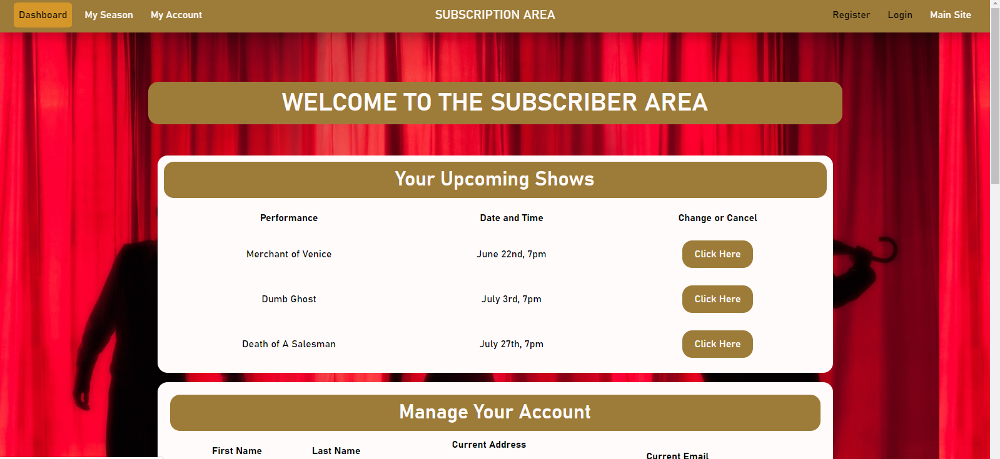
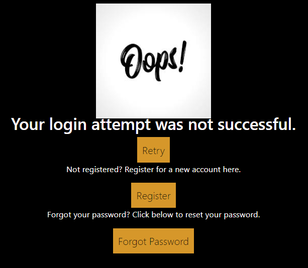
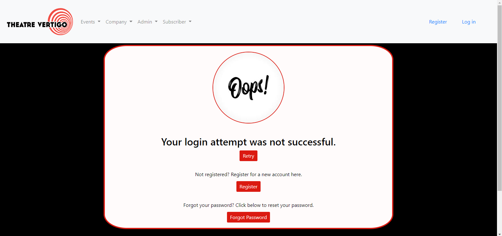
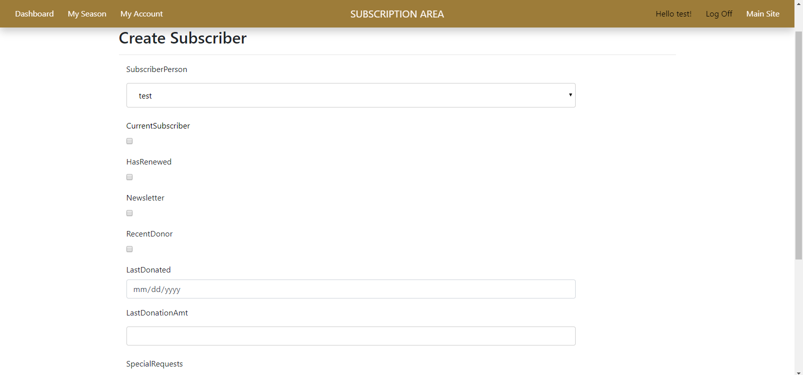
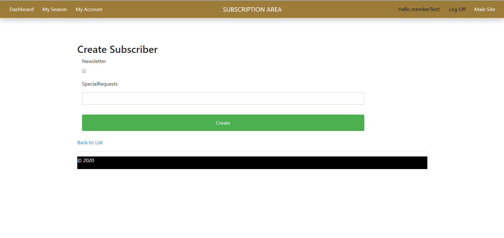
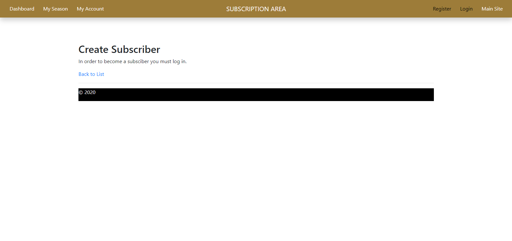
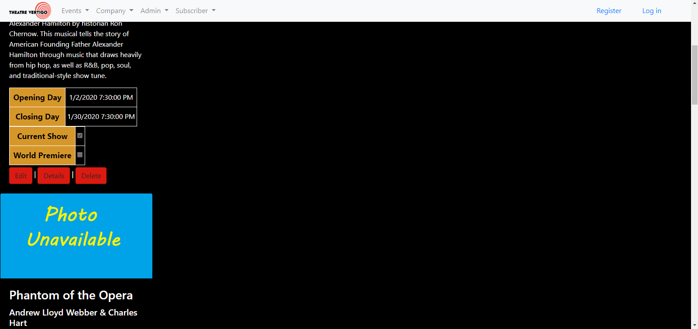
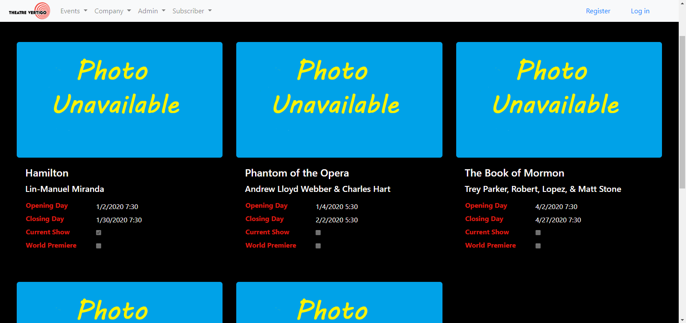
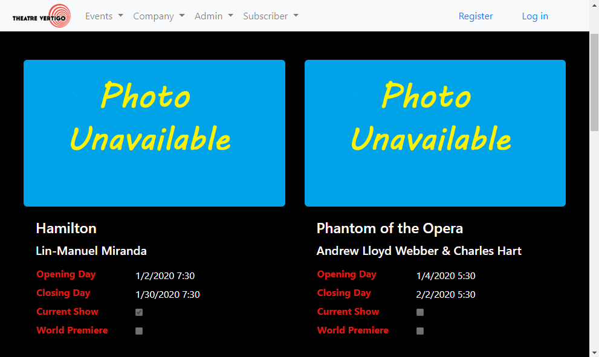

<h1>Live Project</h1>
<h2>Introduction</h2>

At the conclusion of my training at the Tech Acedemy, I had the oppurtunity to work on a project with several other students and instructors acting as a team. I have had numerous oppurtunities to work on fixing bugs, cleaning up code, and adding requested features, as well as working within a group and use version control in a completley comprehensive way. We were tasked with working on a theater companie's full scale MVC Web Application in C#. Over the course of this project I had the opportunity to work on skills that I'm confident I will use again and again on future endeavers.

Below are descriptions of some of the stories I worked on, along with code snippets, screenshots and navigation links.

<em>Jump to: <a href="#front-end-stories">Front End Stories</a>, <a href="#back-end-stories">Back End Stories</a>, <a href="#other-skills-learned">Other Skills</a></em>

<h2>Back End Stories</h2>
<ul>
  <li><a href="#sorting-network-table">Auto Implement Admin Settings</a></li>
  <li><a href="#sorting-network-table2">Create New Subscriber</a></li>
</ul>
<h3><a id="user-content-sorting-network-table" class="anchor" aria-hidden="true" href="#sorting-network-table"><svg class="octicon octicon-link" viewBox="0 0 16 16" version="1.1" width="16" height="16" aria-hidden="true"><path fill-rule="evenodd" d="M4 9h1v1H4c-1.5 0-3-1.69-3-3.5S2.55 3 4 3h4c1.45 0 3 1.69 3 3.5 0 1.41-.91 2.72-2 3.25V8.59c.58-.45 1-1.27 1-2.09C10 5.22 8.98 4 8 4H4c-.98 0-2 1.22-2 2.5S3 9 4 9zm9-3h-1v1h1c1 0 2 1.22 2 2.5S13.98 12 13 12H9c-.98 0-2-1.22-2-2.5 0-.83.42-1.64 1-2.09V6.25c-1.09.53-2 1.84-2 3.25C6 11.31 7.55 13 9 13h4c1.45 0 3-1.69 3-3.5S14.5 6 13 6z"></path></svg></a>Auto Implement Admin Settings</h3>

I was tasked with editing the Admin Controller, to automatically update the entries in the subscriber and productions databases when the admin updated certain settings that are set to a JSON file. After updating the SettingsUpdate method to determine if certain settings were changed, it would call new Methods to loop through the entries in their respective databases and update the set property.

<pre><code>   [HttpPost]
        public ActionResult SettingsUpdate(AdminSettings currentSettings)
        {
            string newSettings = JsonConvert.SerializeObject(currentSettings, Formatting.Indented);
            newSettings = newSettings.Replace("T00:00:00", "");
            string filepath = Server.MapPath(Url.Content("~/AdminSettings.json"));
            string oldSettings = null;
             
            using (StreamReader reader = new StreamReader(filepath))
            {
               oldSettings = reader.ReadToEnd();
            }
            dynamic oldJSON = JObject.Parse(oldSettings);
            dynamic newJSON = JObject.Parse(newSettings);
            if (oldJSON.recent_definition.date != newJSON.recent_definition.date)
            {
                UpdateSubscribers(newJSON);
            }
            if (oldJSON.season_productions != newJSON.season_productions)
            {
                UpdateProductions(newJSON);
            }
            using (StreamWriter writer = new StreamWriter(filepath))
            {
                writer.Write(newSettings);
                return RedirectToAction("Dashboard");
            }
        }

        private void UpdateSubscribers(dynamic newJSON)
        {
            DateTime recentDef = newJSON.recent_definition.date;
            foreach (var subscriber in db.Subscribers)
            {
                if (recentDef >= subscriber.LastDonated)
                {
                    subscriber.RecentDonor = false;
                }
                else
                {
                    subscriber.RecentDonor = true;
                }
            }
            db.SaveChanges();
        }

        private void UpdateProductions(dynamic newJSON)
        {
            int fall = newJSON.season_productions.fall;
            int winter = newJSON.season_productions.winter;
            int spring = newJSON.season_productions.spring;
            foreach (var production in db.Productions)
            {
                if (production.ProductionId == fall || production.ProductionId == winter || production.ProductionId == spring)
                {
                    production.IsCurrent = true;
                }
                else
                {
                    production.IsCurrent = false;
                }
            }
            db.SaveChanges();
        }       
</code></pre>
<h3><a id="user-content-sorting-network-table2" class="anchor" aria-hidden="true" href="#sorting-network-table"><svg class="octicon octicon-link" viewBox="0 0 16 16" version="1.1" width="16" height="16" aria-hidden="true"><path fill-rule="evenodd" d="M4 9h1v1H4c-1.5 0-3-1.69-3-3.5S2.55 3 4 3h4c1.45 0 3 1.69 3 3.5 0 1.41-.91 2.72-2 3.25V8.59c.58-.45 1-1.27 1-2.09C10 5.22 8.98 4 8 4H4c-.98 0-2 1.22-2 2.5S3 9 4 9zm9-3h-1v1h1c1 0 2 1.22 2 2.5S13.98 12 13 12H9c-.98 0-2-1.22-2-2.5 0-.83.42-1.64 1-2.09V6.25c-1.09.53-2 1.84-2 3.25C6 11.31 7.55 13 9 13h4c1.45 0 3-1.69 3-3.5S14.5 6 13 6z"></path></svg></a>Create New Subscriber</h3>

While working on the Subscriber Create Page I needed to ensure that the form from the view was being properly submitted and the controller would successfully create a new subscriber to the database. While doing so, the main obstacle I ran into was how to deal with the user being in a normal role or admin role. If they were signed in as the admin they could select which account they wanted to make a subscriber and that would be passed to the controller, but if not then it should just take the current user's information. I created an if statment within the controller that would decide between the two and take the appropriate action afterwards.

<pre><code>  [HttpPost]
        [ValidateAntiForgeryToken]
        public ActionResult Create([Bind(Include = "SubscriberId,CurrentSubscriber,HasRenewed,Newsletter,RecentDonor,LastDonated,LastDonationAmt,SpecialRequests,Notes")]  Subscriber subscriber)
        {
           
            //The form sent the user's User selection (from SelectList) into the POST method
            //Remove the SubscriberPerson from ModelState, at dbo.Subscribers has no such column
            ModelState.Remove("SubscriberPerson");

            //Extract the Guid as type String from user's selected User (from SelectList)
            string userId = null;

            if (User.IsInRole("Admin"))
            {
                userId = Request.Form["dbUsers"].ToString();
            }
            else 
            { 
                userId = User.Identity.GetUserId();
            }

            if (ModelState.IsValid)
            {
              
                //See tutorials for why SelectList is loaded here as well
                ViewData["dbUsers"] = new SelectList(db.Users.ToList(), "Id", "UserName");

                //LINQ statemenet to query the Guid (via String) of the user's selected User
                subscriber.SubscriberPerson = db.Users.Find(userId);

                //create instance of UserManager class &add user to "Subscriber" role
                var userManager = new UserManager<ApplicationUser>(new UserStore<ApplicationUser>(db));

                if (userManager.GetRoles(userId).Count < 1)
                {
                    userManager.AddToRole(userId, "Subscriber");
                }

                //Add Subscriber to database, linked with User and save changes
                try
                {
                    db.Subscribers.Add(subscriber);
                    db.SaveChanges();
                    return RedirectToAction("Index");
                }
                catch
                {
                    ViewBag.SubscriberError = "Sorry, there was an error submitting this form.";
                    return View("Create");
                }
                
            }
            return View(subscriber);
        }    
</code></pre>

<em>Jump to: <a href="#front-end-stories">Front End Stories</a>, <a href="#back-end-stories">Back End Stories</a>, <a href="#other-skills-learned">Other Skills</a>, <a href="#live-project">Page Top</a></em>

<h2><a id="user-content-front-end-stories" class="anchor" aria-hidden="true" href="#front-end-stories"><svg class="octicon octicon-link" viewBox="0 0 16 16" version="1.1" width="16" height="16" aria-hidden="true"><path fill-rule="evenodd" d="M4 9h1v1H4c-1.5 0-3-1.69-3-3.5S2.55 3 4 3h4c1.45 0 3 1.69 3 3.5 0 1.41-.91 2.72-2 3.25V8.59c.58-.45 1-1.27 1-2.09C10 5.22 8.98 4 8 4H4c-.98 0-2 1.22-2 2.5S3 9 4 9zm9-3h-1v1h1c1 0 2 1.22 2 2.5S13.98 12 13 12H9c-.98 0-2-1.22-2-2.5 0-.83.42-1.64 1-2.09V6.25c-1.09.53-2 1.84-2 3.25C6 11.31 7.55 13 9 13h4c1.45 0 3-1.69 3-3.5S14.5 6 13 6z"></path></svg></a>Front End Stories</h2>
<ul>
 <li><a href="#button-sizing-bug">Subscriber NavBar</a></li>
 <li><a href="#button-sizing-bug2">Login Failure Page</a></li>
 <li><a href="#button-sizing-bug3">Subscriber Create Page</a></li>
 <li><a href="#button-sizing-bug4">All Productions Page</a></li>
</ul>
<h3><a id="user-content-button-sizing-bug" class="anchor" aria-hidden="true" href="#button-sizing-bug"><svg class="octicon octicon-link" viewBox="0 0 16 16" version="1.1" width="16" height="16" aria-hidden="true"><path fill-rule="evenodd" d="M4 9h1v1H4c-1.5 0-3-1.69-3-3.5S2.55 3 4 3h4c1.45 0 3 1.69 3 3.5 0 1.41-.91 2.72-2 3.25V8.59c.58-.45 1-1.27 1-2.09C10 5.22 8.98 4 8 4H4c-.98 0-2 1.22-2 2.5S3 9 4 9zm9-3h-1v1h1c1 0 2 1.22 2 2.5S13.98 12 13 12H9c-.98 0-2-1.22-2-2.5 0-.83.42-1.64 1-2.09V6.25c-1.09.53-2 1.84-2 3.25C6 11.31 7.55 13 9 13h4c1.45 0 3-1.69 3-3.5S14.5 6 13 6z"></path></svg></a>Subscriber NavBar</h3>

I needed to create a navbar for the Subscriber Area. It presented a new task to me as the project as the subscriber area sequestered from the rest of the project, so navigating between the two took some added lines. Also, I got to hone my skills with responsiveness and working with boostraps collapse classes.

<h3><a id="user-content-button-sizing-bug2" class="anchor" aria-hidden="true" href="#button-sizing-bug"><svg class="octicon octicon-link" viewBox="0 0 16 16" version="1.1" width="16" height="16" aria-hidden="true"><path fill-rule="evenodd" d="M4 9h1v1H4c-1.5 0-3-1.69-3-3.5S2.55 3 4 3h4c1.45 0 3 1.69 3 3.5 0 1.41-.91 2.72-2 3.25V8.59c.58-.45 1-1.27 1-2.09C10 5.22 8.98 4 8 4H4c-.98 0-2 1.22-2 2.5S3 9 4 9zm9-3h-1v1h1c1 0 2 1.22 2 2.5S13.98 12 13 12H9c-.98 0-2-1.22-2-2.5 0-.83.42-1.64 1-2.09V6.25c-1.09.53-2 1.84-2 3.25C6 11.31 7.55 13 9 13h4c1.45 0 3-1.69 3-3.5S14.5 6 13 6z"></path></svg></a>Login Failure Page</h3>

I was given a very open ended story to improve the styling of the login failure page. I switched the colors to match the overall theme of teh website, as well as creating buttons that could be used on several different pages throughout.

<h3><a id="user-content-button-sizing-bug3" class="anchor" aria-hidden="true" href="#button-sizing-bug"><svg class="octicon octicon-link" viewBox="0 0 16 16" version="1.1" width="16" height="16" aria-hidden="true"><path fill-rule="evenodd" d="M4 9h1v1H4c-1.5 0-3-1.69-3-3.5S2.55 3 4 3h4c1.45 0 3 1.69 3 3.5 0 1.41-.91 2.72-2 3.25V8.59c.58-.45 1-1.27 1-2.09C10 5.22 8.98 4 8 4H4c-.98 0-2 1.22-2 2.5S3 9 4 9zm9-3h-1v1h1c1 0 2 1.22 2 2.5S13.98 12 13 12H9c-.98 0-2-1.22-2-2.5 0-.83.42-1.64 1-2.09V6.25c-1.09.53-2 1.84-2 3.25C6 11.31 7.55 13 9 13h4c1.45 0 3-1.69 3-3.5S14.5 6 13 6z"></path></svg></a>Subscriber Create Page</h3>

There were two parts to this story. First I noticed that someone had accidently overridden a bootstrap class which was causing the contents to be invisible, so I was able to adjust that and give the page some basic styling. Second, I needed to create different views depending on the user's access privileges.

<h3><a id="user-content-button-sizing-bug4" class="anchor" aria-hidden="true" href="#button-sizing-bug"><svg class="octicon octicon-link" viewBox="0 0 16 16" version="1.1" width="16" height="16" aria-hidden="true"><path fill-rule="evenodd" d="M4 9h1v1H4c-1.5 0-3-1.69-3-3.5S2.55 3 4 3h4c1.45 0 3 1.69 3 3.5 0 1.41-.91 2.72-2 3.25V8.59c.58-.45 1-1.27 1-2.09C10 5.22 8.98 4 8 4H4c-.98 0-2 1.22-2 2.5S3 9 4 9zm9-3h-1v1h1c1 0 2 1.22 2 2.5S13.98 12 13 12H9c-.98 0-2-1.22-2-2.5 0-.83.42-1.64 1-2.09V6.25c-1.09.53-2 1.84-2 3.25C6 11.31 7.55 13 9 13h4c1.45 0 3-1.69 3-3.5S14.5 6 13 6z"></path></svg></a>All Productions Page</h3>

The original page had all the productions listed one after the other on the left hand side of the page, which did not look ggod and was impratical. First I utilized bootstraps column system to make use of the entire page, I also changed the styling to give a cleaner look. Then I made the details link to clicking on the picture, rather than a button, and set the CRUD functions to only be visible when the user was signed in as an admin. Finally, I adjusted it so that the page would better respond to the screen size, going from three down to two per row, and finally displaying them all in one on mobile view.

<em>Jump to: <a href="#front-end-stories">Front End Stories</a>, <a href="#back-end-stories">Back End Stories</a>, <a href="#other-skills-learned">Other Skills</a>, <a href="#live-project">Page Top</a></em>

<h2><a id="user-content-other-skills-learned" class="anchor" aria-hidden="true" href="#other-skills-learned"><svg class="octicon octicon-link" viewBox="0 0 16 16" version="1.1" width="16" height="16" aria-hidden="true"><path fill-rule="evenodd" d="M4 9h1v1H4c-1.5 0-3-1.69-3-3.5S2.55 3 4 3h4c1.45 0 3 1.69 3 3.5 0 1.41-.91 2.72-2 3.25V8.59c.58-.45 1-1.27 1-2.09C10 5.22 8.98 4 8 4H4c-.98 0-2 1.22-2 2.5S3 9 4 9zm9-3h-1v1h1c1 0 2 1.22 2 2.5S13.98 12 13 12H9c-.98 0-2-1.22-2-2.5 0-.83.42-1.64 1-2.09V6.25c-1.09.53-2 1.84-2 3.25C6 11.31 7.55 13 9 13h4c1.45 0 3-1.69 3-3.5S14.5 6 13 6z"></path></svg></a>Other Skills Learned</h2>
<ul>
<li>Working with a group of developers to identify front and back end bugs to the improve usability of an application</li>
<li>Improving project flow by communicating about who is working in what areas and hpw to best navigate the project as a whole</li>
<li>Learning new efficiencies from other developers by observing their workflow and asking questions</li>
<li>Practice with team programming/pair programming when one developer runs into a bug they cannot immediately solve</li>
</ul>

<em>Jump to: <a href="#front-end-stories">Front End Stories</a>, <a href="#back-end-stories">Back End Stories</a>, <a href="#other-skills-learned">Other Skills</a>, <a href="#live-project">Page Top</a></em>

